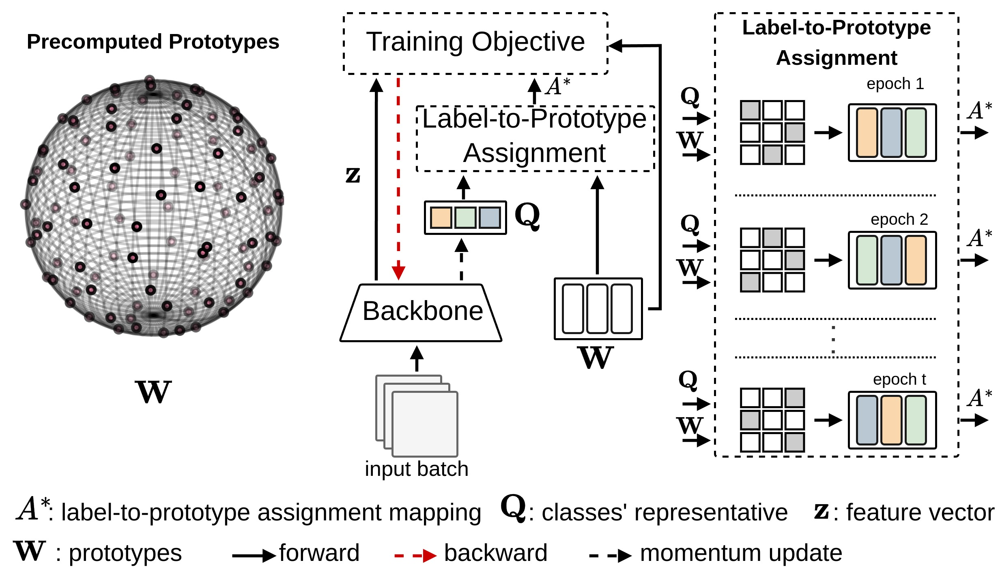
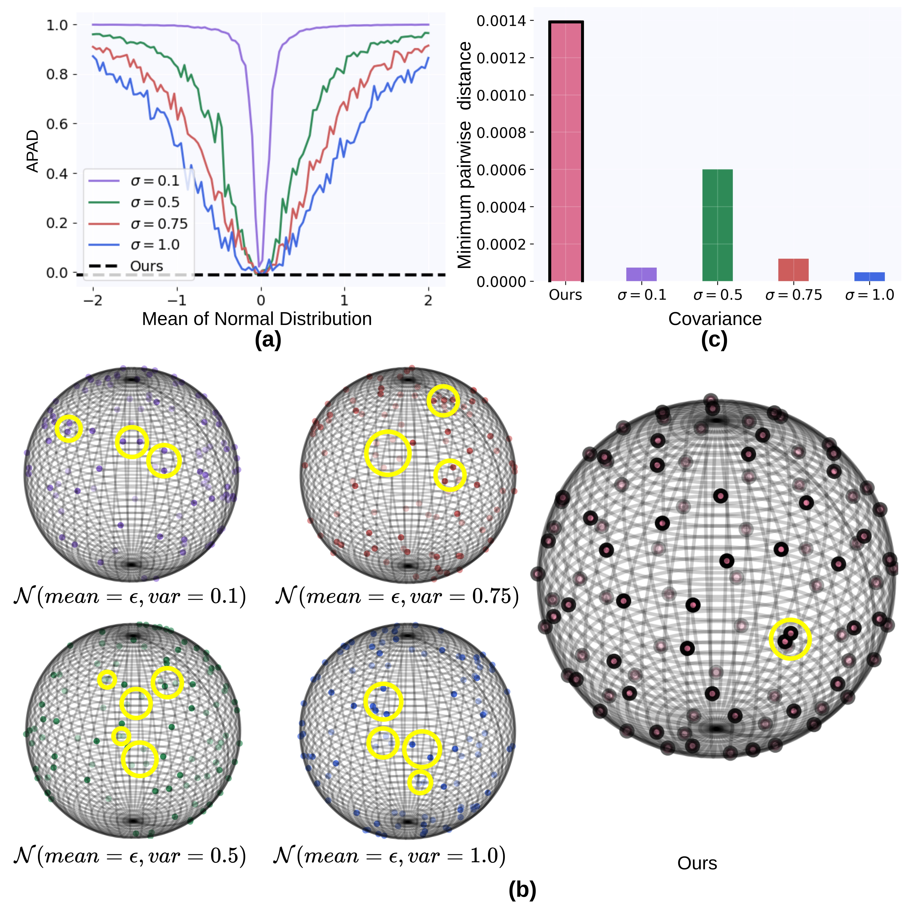

# DL2PA: Hyperspherical Classification with Dynamic Label-to-Prototype Assignment
Official repository for the paper
DL2PA: Hyperspherical Classification with Dynamic Label-to-Prototype Assignment (CVPR 2024).

- Arxiv: 
- Main paper: [main.pdf](assets/main.pdf)
- Supplementary: [supp.pdf](assets/supp.pdf)

The repository includes:
* pre-computed prototypes.
* Script to construct your own prototypes.
* Balanced classification scripts for CIFAR-10, CIFAR-100, ImageNet-200, and ImageNet-1K (ResNet and Swin).
* Long-tailed classification scripts for CIFAR-10LT, CIFAR-100LT, SVHNLT, STL-10LT, and ImageNet-1kLT.

### Pipepline

### Hyperspherical Prototype Estimation


### Precomputed Prototypes 
Please find the estimated prototype in [link](Estimated_prototypes/)

### Estimate prototypes 
One can also generate prototypes with desired dimension:
```
python Prototype_Estimation.py --seed 100 --num_centroids 100 --batch_size 100 --space_dim 50 --num_epoch 1000
```

### Training classifier
The configs can be found in ./config/Blanced or LongTail/FILENAME.yaml.
```
python train.py --cfg {path to config}
```

Here's a more professional and scientific version of your README.md section:

---

## Benchmark Results

### Balanced Classification Results

#### CIFAR-10 Classification Accuracy (%)

| Method   |   d=10   |   d=25   |   d=50   |   d=100  |
|----------|:--------:|:--------:|:--------:|:--------:|
| PSC      |   25.67  |   60.0   |   60.6   |   62.1   |
| Word2Vec |   29.0   |   44.5   |   54.3   |   57.6   |
| HPN      |   51.1   |   63.0   |   64.7   | **65.0** |
| **Ours** | **57.21**| **64.63**| **66.22**|   62.85  |

#### ImageNet-200 Classification Accuracy (%)

| Method   |   d=25   |   d=50   |   d=100  |   d=200  |
|----------|:--------:|:--------:|:--------:|:--------:|
| PSC      |   60.0   |   60.6   |   62.1   |   33.1   |
| Word2Vec |   44.5   |   54.3   |   57.6   |   30.0   |
| HPN      |   63.0   |   64.7   | **65.0** | **44.7** |
| **Ours** | **64.63**| **66.22**|   62.85  |   37.28  |

#### ImageNet-1K Classification Accuracy (%) when $d=512$

| Method               | Venue      | Backbone   | Optimizer | Accuracy (%) |
|----------------------|------------|------------|-----------|--------------|
| PSC                  | CVPR 2016  | ResNet-50  | SGD       | 76.51        |
| DNC                  | ICLR 2022  | ResNet-50  | SGD       | 76.49        |
| Goto et al.          | WACV 2024  | ResNet-50  | SGD       | 77.19        |
| Kasarla et al.       | NeurIPS 2022 | ResNet-50  | SGD       | 74.80        |
| **Ours**             | -          | ResNet-50  | SGD       | **77.47**    |
| DNC                  | ICLR 2022  | ResNet-101 | SGD       | 77.80        |
| Goto et al.          | WACV 2024  | ResNet-101 | SGD       | 78.27        |
| Kasarla et al.       | NeurIPS 2022 | ResNet-152 | SGD       | 78.50       |
| **Ours**             | -          | ResNet-101 | SGD       | **79.63**    |
| PSC                  | CVPR 2016  | Swin-T     | AdamW     | 76.91        |
| **Ours**             | -          | Swin-T     | AdamW     | **77.26**    |

### Long-tailed Classification Results

#### CIFAR-10 LT Classification Accuracy (%) with $d=64$

| Method | 0.005  | 0.01   | 0.02   |
|--------|:------:|:------:|:------:|
| PSC    |  67.3  |  72.8  |  78.6  |
| ETF    |**71.9**|  76.5  |  81.0  |
| **Ours**|  71.5  |**76.9**|**81.4**|

#### CIFAR-100 LT Classification Accuracy (%)

| Method |  $d$  | 0.005  | 0.01   | 0.02   |
|--------|:-----:|:------:|:------:|:------:|
| PSC    |  128  |  38.7  |  43.0  |  48.1  |
| ETF    |  128  | *40.9* | **45.3** |  50.4  |
| **Ours** |  128  | **41.3** |  44.9  | *50.7* |


### Citation
```
@inproceedings{
anonymous2024hyperspherical,
title={Hyperspherical Classification with Dynamic Label-to-Prototype Assignment},
author={Anonymous},
booktitle={Conference on Computer Vision and Pattern Recognition 2024},
year={2024},
url={https://openreview.net/forum?id=kgQZ3EmCvm}
}
```

## Acknowledgments

Here are some great resources we benefit from:

* [MUNIT](https://github.com/NeuralCollapseApplications/ImbalancedLearning) for the Long-Tail classification.
* [HPN](https://github.com/psmmettes/hpn) and [EBV](https://github.com/aassxun/Equiangular-Basis-Vectors) for the Balanced classification. 
* [Understanding Contrastive Representation Learning through Alignment and Uniformity on the Hypersphere](https://github.com/SsnL/align_uniform) for Prototype Estimation.
