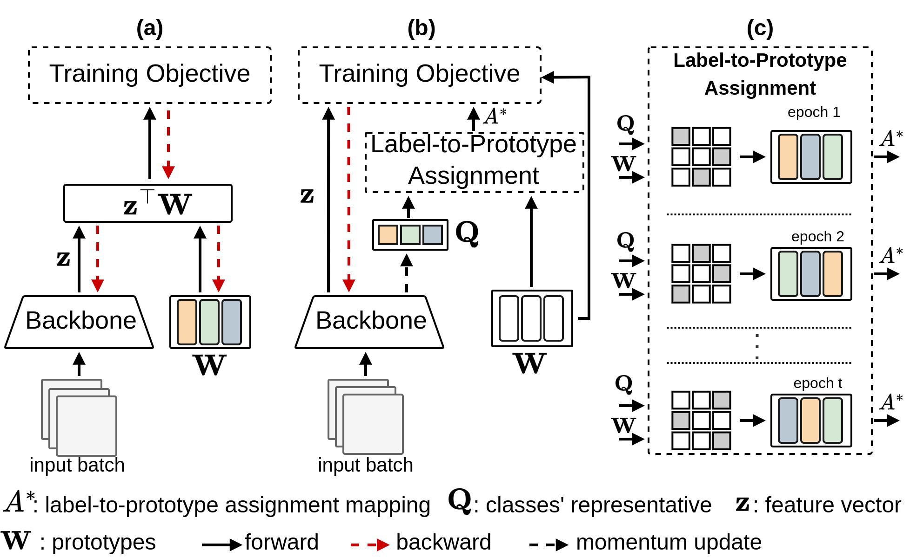

# DL2PA: Hyperspherical Classification with Dynamic Label-to-Prototype Assignment
Official repository for the paper
DL2PA: Hyperspherical Classification with Dynamic Label-to-Prototype Assignment (CVPR 2024). [Arxive](https://arxiv.org/abs/2403.16937)

## Abstract
Aiming to enhance the utilization of metric space by the parametric softmax classifier, recent studies suggest replacing it with a non-parametric alternative.
Although a non-parametric classifier may provide better metric space utilization, it introduces the challenge of capturing inter-class relationships. A shared characteristic among prior non-parametric classifiers is the static assignment of labels to prototypes during the training, i.e., each prototype consistently represents a class throughout the training course.
Orthogonal to previous works, we present a simple yet effective method to optimize the category assigned to each prototype (label-to-prototype assignment) during the training. To this aim, we formalize the problem as a two-step optimization objective over network parameters and label-to-prototype assignment mapping. We solve this optimization using a sequential combination of gradient descent and Bipartide matching.
We demonstrate the benefits of the proposed approach by conducting experiments on balanced and long-tail classification problems using different backbone network architectures.
In particular, our method outperforms its competitors by 1.22% accuracy on CIFAR-100, and 2.15% on ImageNet-200 using a metric space dimension half of the size of its competitors. 


Comparison of the proposed method with the conventional PSC and the previous fixed classifier setup, using a toy example with three classes. Each color denotes a distinct class.
a) Label-to-prototype assignment remains static during training. In PSC, optimization focuses on the network, consisting of the backbone and prototypes **W** . In the case of a fixed classifier, only the backbone is optimized, and prototypes remain fixed.
b) In the proposed method, prototypes within the hypersphere are fixed, and optimization targets the backbone and the label that each prototype represents.
c) Toy example showing changes in label-to-prototype assignment during training.


## Table of Contents
- [Usage](#usage)
- [Balanced Classification Results](#balanced-classification-results)
- [Long-tailed Classification Results](#long-tailed-classification-results)
- [Citation](#citation)
- [Acknowledgments](#acknowledgments)


## Usage
### Prototype Estimation
One can generate equidistributed prototypes with desired dimension:
```
python Prototype_Estimation.py --seed 100 --num_centroids 100 --batch_size 100 --space_dim 50 --num_epoch 1000
```
Also, you can find the estimated prototype in [link](Estimated_prototypes/)
### Training classifier
The configs can be found in ./config/Blanced or LongTail/FILENAME.yaml.
```
python train.py --cfg {path to config}
```

## Balanced Classification Results

<table>
  <tr>
    <th rowspan="2">Method</th>
    <th colspan="4">CIFAR-10</th>
    <th colspan="4">ImageNet-200</th>
  </tr>
  <tr>
    <td>d=10</td>
    <td>d=25</td>
    <td>d=50</td>
    <td>d=100</td>
    <td>d=25</td>
    <td>d=50</td>
    <td>d=100</td>
    <td>d=200</td>
  </tr>
  <tr>
    <td>PSC</td>
    <td>25.67</td>
    <td>60.0</td>
    <td>60.6</td>
    <td>62.1</td>
    <td>60.0</td>
    <td>60.6</td>
    <td>62.1</td>
    <td>33.1</td>
  </tr>
  <tr>
    <td>Word2Vec</td>
    <td>29.0</td>
    <td>44.5</td>
    <td>54.3</td>
    <td>57.6</td>
    <td>44.5</td>
    <td>54.3</td>
    <td>57.6</td>
    <td>30.0</td>
  </tr>
  <tr>
    <td>HPN</td>
    <td>51.1</td>
    <td>63.0</td>
    <td>64.7</td>
    <td><b>65.0</b></td>
    <td>63.0</td>
    <td>64.7</td>
    <td><b>65.0</b></td>
    <td><b>44.7</b></td>
  </tr>
  <tr>
    <td><b>Ours</b></td>
    <td><b>57.21</b></td>
    <td><b>64.63</b></td>
    <td><b>66.22</b></td>
    <td>62.85</td>
    <td><b>64.63</b></td>
    <td><b>66.22</b></td>
    <td>62.85</td>
    <td>37.28</td>
  </tr>
</table>


#### ImageNet-1K Classification Accuracy (%) when $d=512$:

| Method               | Venue        | Backbone   | Optimizer | Accuracy (%) |
|----------------------|--------------|------------|-----------|--------------|
| PSC                  | CVPR 2016    | ResNet-50  | SGD       | 76.51        |
| DNC                  | ICLR 2022    | ResNet-50  | SGD       | 76.49        |
| Goto et al.          | WACV 2024    | ResNet-50  | SGD       | 77.19        |
| Kasarla et al.       | NeurIPS 2022 | ResNet-50  | SGD       | 74.80        |
| **Ours**             | CVPR 2024    | ResNet-50  | SGD       | **77.47**    |
| DNC                  | ICLR 2022    | ResNet-101 | SGD       | 77.80        |
| Goto et al.          | WACV 2024    | ResNet-101 | SGD       | 78.27        |
| Kasarla et al.       | NeurIPS 2022 | ResNet-152 | SGD       | 78.50       |
| **Ours**             | CVPR 2024            | ResNet-101 | SGD       | **79.63**    |
| PSC                  | CVPR 2016    | Swin-T     | AdamW     | 76.91        |
| **Ours**             | CVPR 2024          | Swin-T     | AdamW     | **77.26**    |

## Long-tailed Classification Results

<table>
  <tr>
    <th rowspan="2">Method</th>
    <th colspan="3">CIFAR-10 LT (d=64)</th>
    <th colspan="3">SVHN LT (d=64)</th>
    <th colspan="3">STL-10 LT (d=64)</th>
  </tr>
  <tr>
    <td>0.005</td>
    <td>0.01</td>
    <td>0.02</td>
    <td>0.005</td>
    <td>0.01</td>
    <td>0.02</td>
    <td>0.005</td>
    <td>0.01</td>
    <td>0.02</td>
  </tr>
  <tr>
    <td>PSC</td>
    <td>67.3</td>
    <td>72.8</td>
    <td>78.6</td>
    <td>40.5</td>
    <td>40.9</td>
    <td>49.3</td>
    <td>33.1</td>
    <td><b>37.9</b></td>
    <td><b>38.8</b></td>
  </tr>
  <tr>
    <td>ETF</td>
    <td><b>71.9</b></td>
    <td>76.5</td>
    <td>81.0</td>
    <td><b>42.8</b></td>
    <td>45.7</td>
    <td><b>49.8</b></td>
    <td>33.5</td>
    <td>37.2</td>
    <td>37.9</td>
  </tr>
  <tr>
    <td>Ours</td>
    <td>71.5</td>
    <td><b>76.9</b></td>
    <td><b>81.4</b></td>
    <td>40.9</td>
    <td><b>47.0</b></td>
    <td>49.7</td>
    <td><b>35.7</b></td>
    <td>35.6</td>
    <td>38.0</td>
  </tr>
</table>

#### CIFAR-100 LT Classification Accuracy (%):

| Method |  d  | 0.005  | 0.01   | 0.02   |
|--------|:---:|:------:|:------:|:------:|
| PSC    | 128 |  38.7  |  43.0  |  48.1  |
| ETF    | 128 | *40.9* | **45.3** |  50.4  |
| **Ours** | 128 | **41.3** |  44.9  | **50.7** |


### Citation
```
@InProceedings{Saadabadi_2024_CVPR,
    author    = {Saadabadi, Mohammad Saeed Ebrahimi and Dabouei, Ali and Malakshan, Sahar Rahimi and Nasrabadi, Nasser M.},
    title     = {Hyperspherical Classification with Dynamic Label-to-Prototype Assignment},
    booktitle = {Proceedings of the IEEE/CVF Conference on Computer Vision and Pattern Recognition (CVPR)},
    month     = {June},
    year      = {2024},
    pages     = {17333-17342}
}
```

## Acknowledgments

Here are some great resources we benefit from:

* [MUNIT](https://github.com/NeuralCollapseApplications/ImbalancedLearning) for the Long-Tail classification.
* [HPN](https://github.com/psmmettes/hpn) and [EBV](https://github.com/aassxun/Equiangular-Basis-Vectors) for the Balanced classification. 
* [Understanding Contrastive Representation Learning through Alignment and Uniformity on the Hypersphere](https://github.com/SsnL/align_uniform) for Prototype Estimation.

## Contact
If there is a question regarding any part of the code, or it needs further clarification, please create an issue or send me an email: me00018@mix.wvu.edu.
